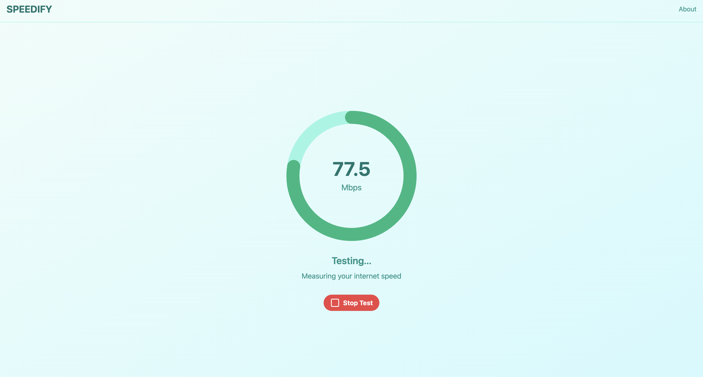

# Speedify ⚙️

Speedify is a modern internet speed testing tool designed for simplicity and accuracy.

## 🌟 Features

- Real-time speed test visualization
- Dynamic animations
- User-friendly interface

## 🎨 Screenshot



## 🚀 Getting Started

1. **Clone the repository:**
```bash
git clone https://github.com/yourusername/speedify.git
```

2. **Navigate to the project directory:**
```bash
cd speedify
```

3. **Install dependencies:**
  ```bash
npm install
```
3. **Start the development server:**
  ```bash
npm start
```
## 🛠️ Usage

- Speed Test: Click the "Play" button to start the speed test and see real-time results.
- About Section: Click the "About" button to learn more about the application.
- Upload / Download Speed Detector (Coming Soon)

## 📂 Folder Structure
```bash
speedify/
├── dist/
├── node_modules/
├── public/
│   └── index.html
├── src/
│   ├── components/
│   │   └── Speedify.tsx
│   ├── styles/
│   │   ├── tailwind.css
│   │   └── main.css
│   ├── App.tsx
│   ├── index.tsx
│   └── vite.config.ts
├── .gitignore
├── LICENSE
├── README.md
├── package.json
└── package-lock.json
```

## 👨‍💻 Author

Yaj Kotak (2024)

## 📄 License

This project is licensed under the MIT License.

## Contact

If you have any questions or feedback, you can reach me through the following methods:

  <a href="https://www.linkedin.com/in/yajkotak" target="_blank">
    
  </a>


